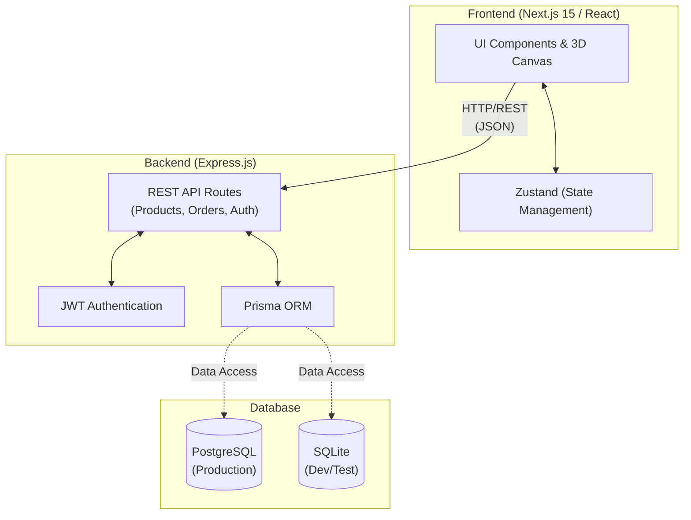

# ELEVATE — Premium Luxury Boys Fashion

> Ultra-premium e-commerce platform for luxury boys' fashion

## Overview

ELEVATE is a full-stack luxury e-commerce platform dedicated to high-end boys' fashion. Designed with a focus on an ultra-premium dark aesthetic, the application features an engaging, interactive 3D frontend powered by React Three Fiber and GSAP animations. The backend is a robust RESTful API built on Express.js and Prisma ORM, providing scalable and reliable data management for products, categories, orders, and user authentication.

## Tech Stack

### Frontend
- **Framework:** Next.js 15 (App Router), React 19
- **3D & Rendering:** Three.js, @react-three/fiber, @react-three/drei
- **Animations:** GSAP (ScrollTrigger plugin)
- **State Management:** Zustand
- **Styling:** CSS Modules (Tailwind CSS is explicitly avoided)

### Backend
- **Framework:** Express.js (Node.js)
- **ORM:** Prisma
- **Database:** PostgreSQL (Primary Production), SQLite (Local Development/Testing)
- **Authentication:** JWT (jsonwebtoken) and bcryptjs

## Project Architecture

### Folder Structure
```text
.
├── backend/                   # Express.js REST API
│   ├── middleware/            # Express middlewares (e.g., Auth)
│   ├── prisma/                # Prisma schema and seed scripts
│   ├── routes/                # API route definitions
│   └── server.js              # Entry point for backend
└── frontend/                  # Next.js Application
    ├── src/                   # React components, pages, and hooks
    ├── next.config.mjs        # Next.js configuration (redirects, image domains)
    └── package.json           # Frontend dependencies
```

### High-Level Architecture Flowchart



## Setup Instructions

### Prerequisites
- Node.js (v18+ recommended)
- npm

### Backend Setup
1. Navigate to the backend directory:
   ```bash
   cd backend
   ```
2. Install dependencies:
   ```bash
   npm install
   ```
3. Copy the environment file:
   ```bash
   cp .env.example .env
   ```
4. Setup the database and seed data:
   ```bash
   npx prisma db push
   npm run seed
   ```
5. Start the backend server:
   ```bash
   npm run dev
   ```
   *(Runs on http://localhost:5000)*

### Frontend Setup
1. Navigate to the frontend directory:
   ```bash
   cd frontend
   ```
2. Install dependencies (requires legacy peer deps due to Next/React 19 & Three.js interactions):
   ```bash
   npm install --legacy-peer-deps
   ```
3. Start the frontend development server:
   ```bash
   npm run dev
   ```
   *(Runs on http://localhost:3000)*

## Features
- **3D Hero Section:** Implemented using Three.js and React Three Fiber to deliver an engaging, immersive visual experience.
- **Animations:** High-performance scroll animations powered by GSAP and ScrollTrigger.
- **Authentication:** Secure JWT-based user authentication system.
- **Cart Management:** Global state management for an intuitive shopping experience using Zustand.
- **Dynamic Content:** Products and categories are dynamically loaded via the REST API and seeded using idempotent Prisma scripts.
